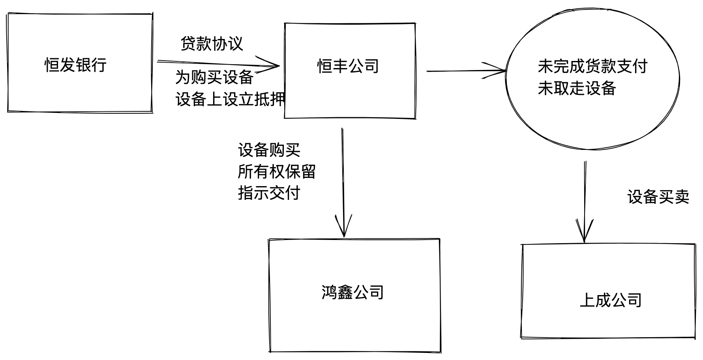

- 
- 案情图示：
	- 
- 时间线：
  collapsed:: true
	- 2021年1月6日：恒发银行和恒丰公司：《贷款合同》
	- 2021年1月10日：鸿鑫公司和恒丰公司：《设备采购》
		- 分期付款协议中，未完全支付+指示交付的情况下——所有权移是否移转
			- 有效
				- 上成公司——无权处分
					- 善意取得
			- 无效
				- 鸿鑫仍然保有所有权
				- 正当处分。
					- 《抵押合同》的效力如何。
	- 2021年1月13日：恒发银行和鸿鑫公司：《抵押合同》
	- 2021年8月10日：恒丰公司迟延履行
	- 2021年8月12日：鸿鑫公司大量亏损，一物二卖于上成公司
		- 2021年8月16日：上成公司完成履行
		- 2021年8月25，取走该设备
	- 2021年10月10日：恒发银行欲实现抵押权
- # 恒丰公司和鸿鑫公司之间的买卖协议分析
	- ## 法律性质分析——所有权保留or分期买卖？
		-